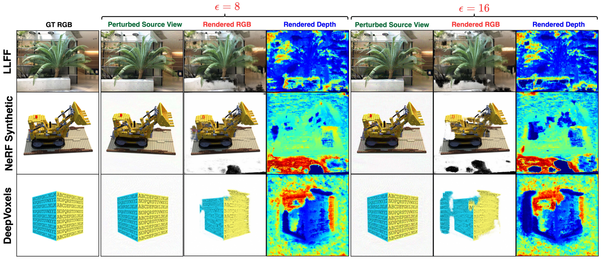

# NeRFool: Uncovering the Vulnerability of Generalizable Neural Radiance Fields against Adversarial Perturbations
Yonggan Fu, Ye Yuan, Souvik Kundu, Shang Wu, Shunyao Zhang, Yingyan (Celine) Lin

Accepted at ICML 2023. [ [Paper](http://proceedings.mlr.press/v202/fu23g/fu23g.pdf) | [Video](https://www.youtube.com/watch?v=oC8Xi4cEGKw) | [Slide](https://drive.google.com/file/d/1PCDSLrnuf8CZ3VloqBGldq8mR2CWM22o/view?usp=drive_link) ]


## An Overview of NeRFool
- Generalizable Neural Radiance Fields (GNeRF) are one of the most promising real-world solutions for novel view synthesis, thanks to their cross-scene generalization capability and thus the possibility of instant rendering on new scenes. While adversarial robustness is essential for real-world applications, little study has been devoted to understanding its implication on GNeRF. In this work, we present NeRFool, which to the best of our knowledge is the first work that sets out to understand the adversarial robustness of GNeRF. Specifically, NeRFool unveils the vulnerability patterns and important insights regarding GNeRF's adversarial robustness and provides guidelines for defending against our proposed attacks.

<p align="center">
  
</p>

## Citation
- If you find our work interesting or helpful to your research, welcome to cite our paper:

```
@article{fu2023nerfool,
  title={NeRFool: Uncovering the Vulnerability of Generalizable Neural Radiance Fields against Adversarial Perturbations},
  author={Fu, Yonggan and Yuan, Ye and Kundu, Souvik and Wu, Shang and Zhang, Shunyao and Lin, Yingyan},
  journal={arXiv preprint arXiv:2306.06359},
  year={2023}
}
```


## Code Usage


### Prerequisites

* **Install the conda environment**:

``` 
conda env create -f env.yml
```
* **Prepare the evaluation data**: The evaluation datasets, including LLFF, NeRF Synthetic, and DeepVoxels, are organized in the following structure:

```
├──data/
    ├──nerf_llff_data/
    ├──nerf_synthetic/
    ├──deepvoxels/
```

They can be downloaded by running the following command under the `data/` directory:

```
bash download_eval_data.sh
```

* **Prepare the pretrained model**: To evaluate the adversarial robustness of pretrained GNeRFs, you can download the official [IBRNet](https://github.com/googleinterns/IBRNet) model from [here](https://drive.google.com/uc?id=165Et85R8YnL-5NcehG0fzqsnAUN8uxUJ).


* **Update the paths** to datasets & pretrained models in the configuration files: `configs/eval_*`.


### Attacking GNeRFs using NeRFool

- Attack a specific view direction using **a view-specific attack scheme** on the LLFF dataset:

```
CUDA_VISIBLE_DEVICES=0 python eval_adv.py --config ../configs/eval_llff.txt --expname test --num_source_views 4 --adv_iters 1000 --adv_lr 1 --epsilon 8 --use_adam --adam_lr 1e-3 --lr_gamma=1 --view_specific
```

- Generate **universal adversarial perturbations** across different views on the LLFF dataset:

```
CUDA_VISIBLE_DEVICES=0 python eval_adv.py --config ../configs/eval_llff.txt --expname test --num_source_views 4 --adv_iters 1000 --adv_lr 1 --epsilon 8 --use_adam --adam_lr 1e-3 --lr_gamma=1
```

## Acknowledgement

This codebase is modified on top of [[IBRNet]](https://github.com/googleinterns/IBRNet).


